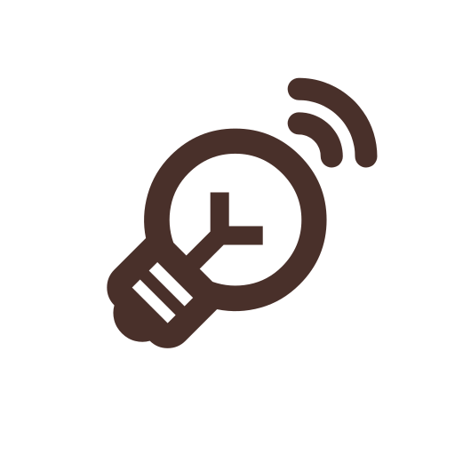
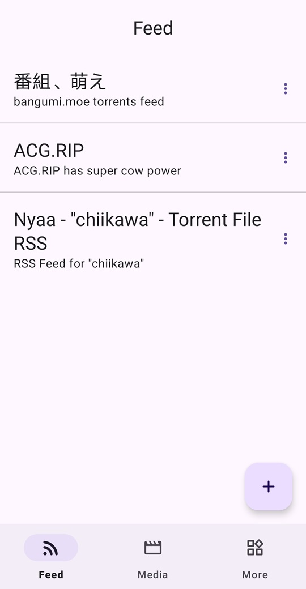
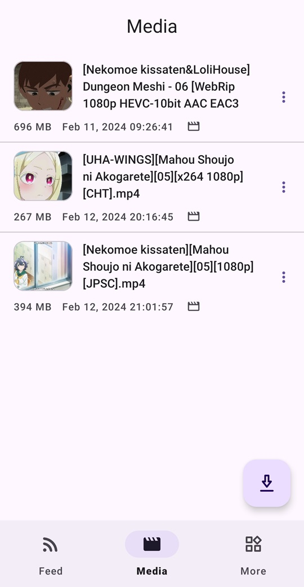
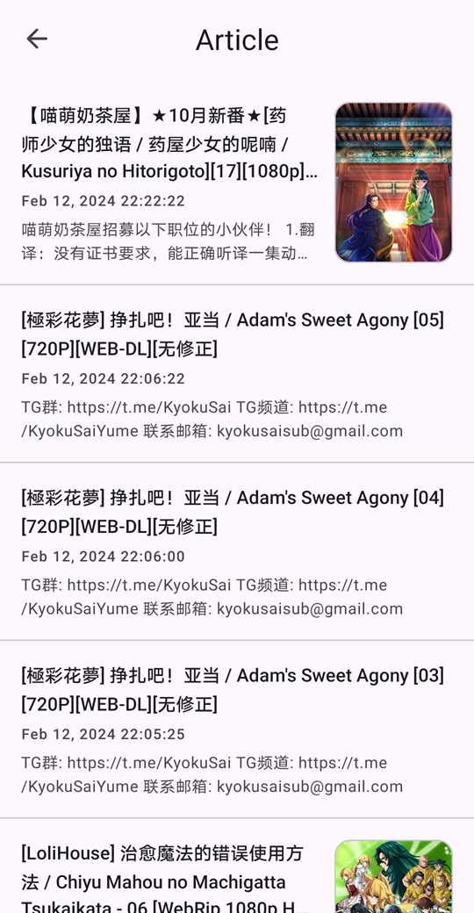
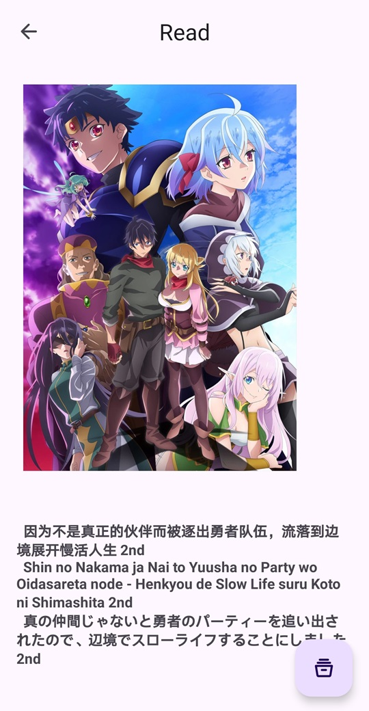
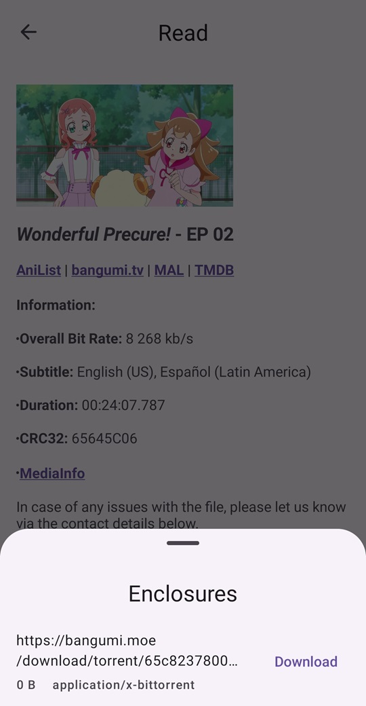
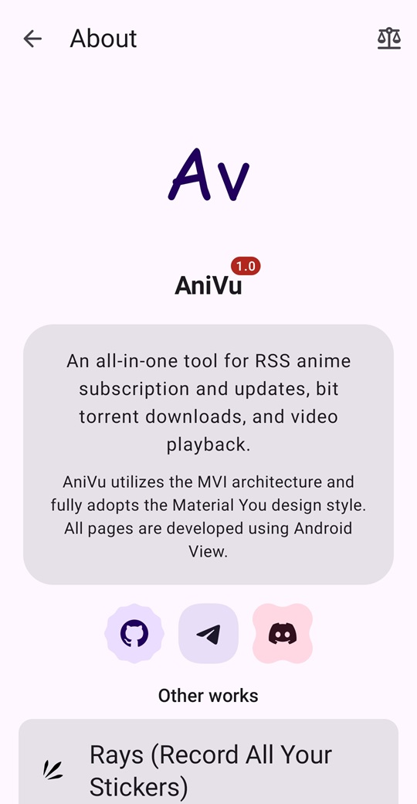
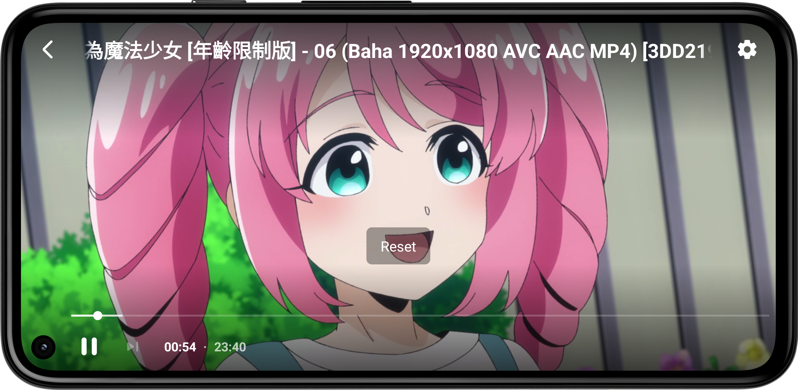

    

        
    

    <h1>🥰 AniVu</h1>
    

        
        
        
        
        
        
        
    

    

        <b>AniVu</b>, an <b>all-in-one tool</b> for <b>RSS anime subscription and updates</b>, <b>bit torrent downloads</b>, and <b>video playback</b>.
    

    

        AniVu utilizes the <b><a href="https://developer.android.com/topic/architecture#recommended-app-arch">MVI</a></b> architecture and fully adopts the <b><a href="https://m3.material.io/">Material You</a></b> design style. All pages are developed using <b>Android View</b> and <b>Jetpack Compose</b>.
    

    

        <b><a href="doc/readme/README-zh-rCN.md">中文</a></b>&nbsp&nbsp&nbsp|&nbsp&nbsp&nbsp<b><a href="doc/readme/README-zh-rTW.md">正體中文</a></b>&nbsp&nbsp&nbsp|&nbsp&nbsp&nbsp<b><a href="https://crowdin.com/project/anivu">Help us translate</a></b>
    

## 💡 Features

1. **Subscribe to RSS**, Update RSS, **Read** RSS
2. **Automatically update RSS** subscriptions
3. **Download enclosures** (enclosure tags) of **torrent or magnet** links in RSS articles
4. **Seeding** downloaded files
5. **Play downloaded videos**
6. Support variable playback **speed**, **long press** to speed up playback
7. **Double-finger** gesture to **rotate and zoom** video
8. **Swipe** on the video to **control volume**, **brightness**, and **playback position**
9. **Searching** existing **RSS subscription content**
10. **Play other videos on the phone**
11. Support **dark mode**
12. ......

## 🚧 Todo

1. Automatically **download new videos**
2. **Customize player settings**, such as default screen scale, surface type used by the player, and more
3. **Float** video playback **window**
4. **Automatically** play the **next video**

## 🤩 Screenshots

 
 
 
 

## 🌏 Translation

If you are interested, please help us **translate**, thank you.

## 🛠 Primary technology stack

- **MVI** Architecture
- Jetpack **Compose**
- Kotlin **Coroutines and Flow**
- **Material You**
- **ViewModel**
- **Room**
- **Paging 3**
- **Hilt**
- Media3 **ExoPlayer**
- **WorkManager**
- **DataStore**
- Splash Screen
- Navigation
- Coil

## ✨ Other works

<table>
<thead>
  <tr>
    <th>Work</th>
    <th>Description</th>
    <th>Link</th>
  </tr>
</thead>
<tbody>
  <tr>
    <td></td>
    <td><b>Rays (Record All Your Stickers)</b>, A tool to <b>record, search and manage stickers</b> on your phone. 🥰 Are you still struggling with <b>too many stickers on your phone</b> and having trouble finding the ones you want? This tool will help you <b>manage your stickers</b>! 😋</td>
    <td><a href="https://github.com/SkyD666/Rays-Android">https://github.com/SkyD666/Rays-Android</a></td>
  </tr>
  <tr>
    <td></td>
    <td><b>Raca (Record All Classic Articles)</b>, a tool to <b>record and search abstract passages and mini-essays</b> in the comments section locally. 🤗 Are you still having trouble remembering the content of your mini-essay and facing the embarrassing situation of forgetting the front, middle and back? Using this tool will help you <b>record the mini-essays</b> you come across and never worry about forgetting them again! 😋</td>
    <td><a href="https://github.com/SkyD666/Raca-Android">https://github.com/SkyD666/Raca-Android</a></td>
  </tr>
  <tr>
    <td></td>
    <td><b>NightScreen</b>, when you <b>use your phone at night</b> 🌙, Night Screen can help you <b>reduce the brightness</b> of the screen and <b>reduce the damage to your eyes</b>.</td>
    <td><a href="https://github.com/SkyD666/NightScreen">https://github.com/SkyD666/NightScreen</a></td>
  </tr>
</tbody>
</table>

## 📃 License

This software code is available under the following **license**

[**GNU General Public License v3.0**](LICENSE)
