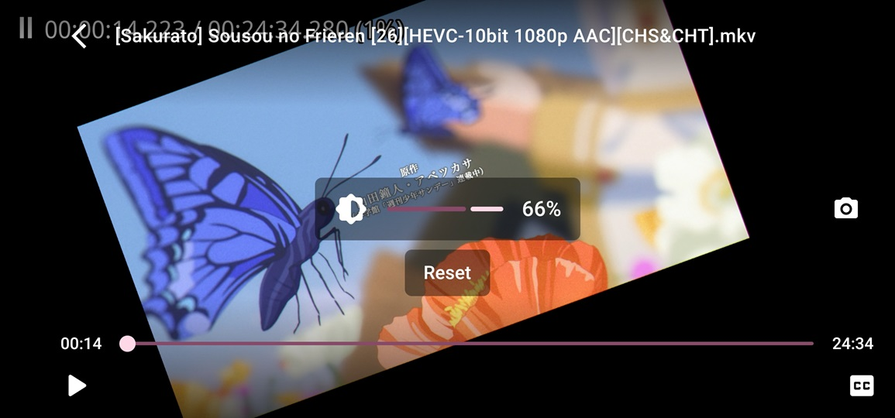

    

        
    

    <h1>🥰 PodAura</h1>
    
<b>P</b>odcasts <b>O</b>rganized <b>D</b>iversely with <b>A</b>udio-Video <b>U</b>nification for <b>R</b>ich <b>A</b>ccess

    

        
        
        
        
        
        
        
        
    

    

        An <b>all-in-one Podcast tool</b> for <b>RSS subscription and updates</b>, <b>media downloads</b> and <b>playback</b>.
    

    

        PodAura utilizes the <b><a href="https://developer.android.com/topic/architecture#recommended-app-arch">MVI</a></b> architecture and fully adopts the <b><a href="https://m3.material.io/">Material You</a></b> design style. All pages are developed using <b>Jetpack Compose</b>.
    

    

        <b><a href="doc/readme/README-zh-rCN.md">简体中文</a></b>&nbsp&nbsp&nbsp|&nbsp&nbsp&nbsp<b><a href="doc/readme/README-zh-rTW.md">正體中文</a></b>&nbsp&nbsp&nbsp|&nbsp&nbsp&nbsp<b><a href="https://crowdin.com/project/anivu">Help us translate</a></b>
    

## 💡 Features

1. **Subscribe to RSS**, Update RSS, **Read** RSS
2. **Automatically update RSS** subscriptions
3. **Download** enclosures (enclosure tags) in RSS articles, also supports **torrent or magnet links**
4. **Seeding** downloaded files
5. **Play media enclosures or downloaded videos**
6. Support variable playback **speed**, setup **audio track**, **subtitle track**, etc
7. **Double-finger** gesture to **rotate and zoom** video, **long press** to speed up playback
8. **Swipe** on the video to **control volume**, **brightness**, and **playback position**
9. **Searching** existing **RSS subscription content**
10. **Play other videos on the phone**
11. Support **custom MPV player**
12. Support Android **Picture in Picture**
13. Support **import and export** subscriptions via **OPML**
14. Support **dark mode**
15. ......

## 🤩 Screenshots

 
 
 
 
 

## 🌏 Translation

If you are interested, please help us **translate**, thank you.

## 🛠 Primary technology stack

- **MVI** Architecture
- Jetpack **Compose**
- Kotlin **Coroutines and Flow**
- **Material You**
- **ViewModel**
- **Room**
- **Paging 3**
- **Hilt**
- **MPV**
- **WorkManager**
- **DataStore**
- Splash Screen
- Navigation
- Coil

## ✨ Star History

## 🎈 Other works

<table>
<thead>
  <tr>
    <th>Work</th>
    <th>Description</th>
    <th>Link</th>
  </tr>
</thead>
<tbody>
  <tr>
    <td></td>
    <td><b>Rays (Record All Your Stickers)</b>, A tool to <b>record, search and manage stickers</b> on your phone. 🥰 Are you still struggling with <b>too many stickers on your phone</b> and having trouble finding the ones you want? This tool will help you <b>manage your stickers</b>! 😋</td>
    <td><a href="https://github.com/SkyD666/Rays-Android">https://github.com/SkyD666/Rays-Android</a></td>
  </tr>
  <tr>
    <td></td>
    <td><b>Raca (Record All Classic Articles)</b>, a tool to <b>record and search abstract passages and mini-essays</b> in the comments section locally. 🤗 Are you still having trouble remembering the content of your mini-essay and facing the embarrassing situation of forgetting the front, middle and back? Using this tool will help you <b>record the mini-essays</b> you come across and never worry about forgetting them again! 😋</td>
    <td><a href="https://github.com/SkyD666/Raca-Android">https://github.com/SkyD666/Raca-Android</a></td>
  </tr>
  <tr>
    <td></td>
    <td><b>NightScreen</b>, when you <b>use your phone at night</b> 🌙, Night Screen can help you <b>reduce the brightness</b> of the screen and <b>reduce the damage to your eyes</b>.</td>
    <td><a href="https://github.com/SkyD666/NightScreen">https://github.com/SkyD666/NightScreen</a></td>
  </tr>
</tbody>
</table>

## 📃 License

This software code is available under the following **license**

[**GNU General Public License v3.0**](LICENSE)
