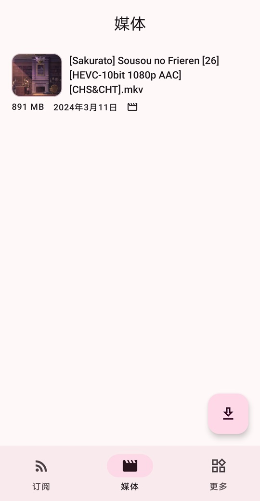
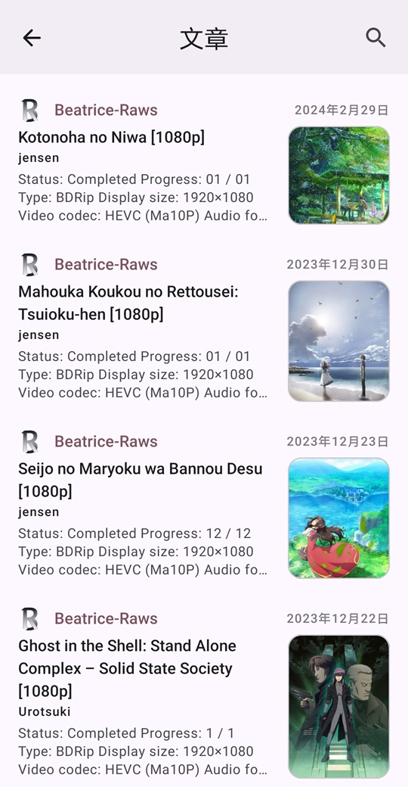
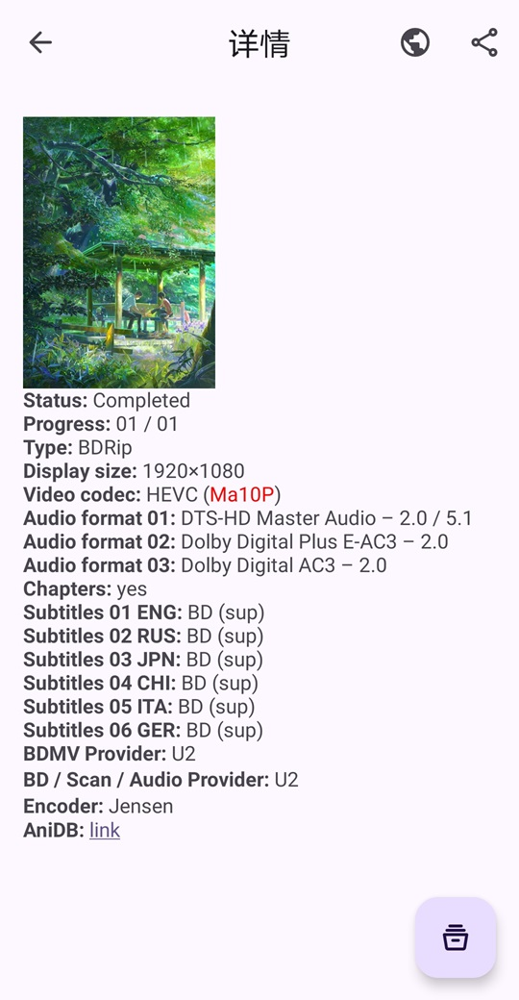
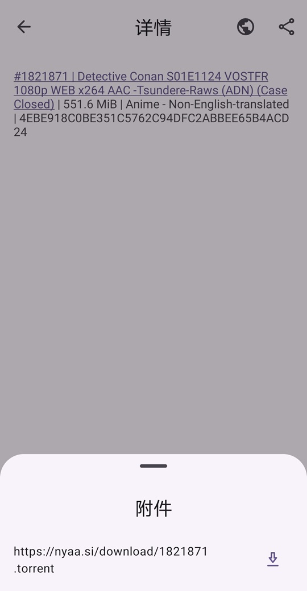

    

        
    

    <h1>🥰 AniVu</h1>
    

        
        
        
        
        
        
    

    

        <b>AniVu</b>，一个集<b> RSS 番剧订阅与更新、比特洪流下载、视频播放</b>为一体的工具。
    

    

        使用 <b><a href="https://developer.android.com/topic/architecture#recommended-app-arch">MVI</a></b> 架构，完全采用 <b><a href="https://m3.material.io/">Material You</a></b> 设计风格。使用 <b>Android View</b> 和 <b>Jetpack Compose</b> 混合开发。
    

    

        <b><a href="../../README.md">English</a></b>&nbsp&nbsp&nbsp|&nbsp&nbsp&nbsp<b>中文</b>&nbsp&nbsp&nbsp|&nbsp&nbsp&nbsp<b><a href="README-zh-rTW.md">正體中文</a></b>&nbsp&nbsp&nbsp|&nbsp&nbsp&nbsp<b><a href="https://crowdin.com/project/anivu">帮助我们翻译</a></b>
    

## 💡主要功能

1. **订阅** RSS、**更新** RSS、**阅读** RSS
2. **自动更新 RSS 订阅**
3. **下载** RSS 文章中的 **BT 种子或磁力链接**附件（enclosure 标签）
4. 已下载**文件做种**
5. **播放**已下载的**视频文件**
6. **更改播放速度**、**长按**视频**倍速播放**
7. **双指旋转缩放视频画面**
8. **滑动**调整**音量**、**屏幕亮度和播放位置**
9. 支持**搜索已获取的 RSS 订阅或文章**
10. **播放**手机中的**其他视频**
11. 支持**深色模式**
12. ......

## 🚧待实现

1. **自动下载订阅中的新视频**
2. **自定义播放器配置**，例如：默认的画面比例、播放器使用的 Surface type 等等
3. **悬浮窗播放视频**
4. **自动播放**下一个视频

## 🤩应用截图

 
 
 
 

## 🌏翻译

如果您对此项目感兴趣，请**帮助我们进行翻译**，谢谢。

## 🛠主要技术栈

- **MVI** Architecture
- Jetpack **Compose**
- Kotlin **Coroutines and Flow**
- **Material You**
- **ViewModel**
- **Room**
- **Paging 3**
- **Hilt**
- Media3 **ExoPlayer**
- **WorkManager**
- **DataStore**
- Splash Screen
- Navigation
- Coil

## ✨其他应用

<table>
<thead>
  <tr>
    <th>工具</th>
    <th>描述</th>
    <th>传送门</th>
  </tr>
</thead>
<tbody>
  <tr>
    <td></td>
    <td><b>Rays (Record All Your Stickers)</b>，一个在本地<b>记录、查找、管理表情包</b>的工具。 🥰 您还在为手机中的<b>表情包太多</b>，找不到想要的表情包而苦恼吗？使用这款工具将帮助您<b>管理您存储的表情包</b>，再也不因为找不到表情包而烦恼！😋</td>
    <td><a href="https://github.com/SkyD666/Rays-Android">https://github.com/SkyD666/Rays-Android</a></td>
  </tr>
  <tr>
    <td></td>
    <td><b>Raca (Record All Classic Articles)</b>，一个在本地<b>记录、查找抽象段落/评论区小作文</b>的工具。 🤗 您还在为记不住小作文内容，面临<b>前面、中间、后面都忘了</b>的尴尬处境吗？使用这款工具将<b>帮助您记录您所遇到的小作文</b>，再也不因为忘记而烦恼！😋</td>
    <td><a href="https://github.com/SkyD666/Raca-Android">https://github.com/SkyD666/Raca-Android</a></td>
  </tr>
  <tr>
    <td></td>
    <td><b>NightScreen</b>，当您在<b>夜间🌙</b>使用手机时，NightScreen 可以帮助您<b>减少屏幕亮度</b>，减少对眼睛的伤害。</td>
    <td><a href="https://github.com/SkyD666/NightScreen">https://github.com/SkyD666/NightScreen</a></td>
  </tr>
</tbody>
</table>

## 📃许可证

使用此软件代码需**遵循以下许可证协议**

[**GNU General Public License v3.0**](../../LICENSE)
