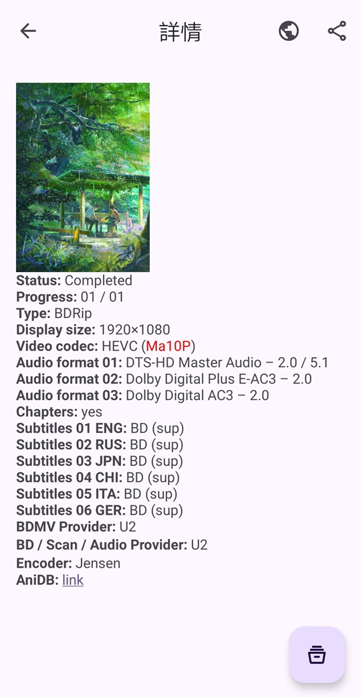
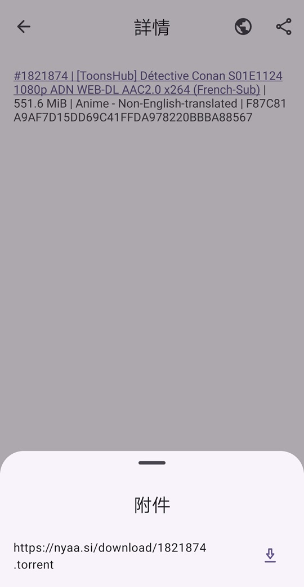

    

        
    

    <h1>🥰 AniVu</h1>
    

        
        
        
        
        
        
    

    

        <b>AniVu</b>，一個集<b> RSS 番劇訂閱與更新、BitTorrent下載、影片播放</b>為一體的工具。
    

    

        使用 <b><a href="https://developer.android.com/topic/architecture#recommended-app-arch">MVI</a></b> 架構，完全採用 <b><a href="https://m3.material.io/">Material You</a></b> 設計風格。使用 <b>Android View</b> 和 <b>Jetpack Compose</b> 混合開發。
    

    

        <b><a href="../../README.md">English</a></b>&nbsp&nbsp&nbsp|&nbsp&nbsp&nbsp<b><a href="README-zh-rCN.md">中文</a></b>&nbsp&nbsp&nbsp|&nbsp&nbsp&nbsp<b>正體中文</b>&nbsp&nbsp&nbsp|&nbsp&nbsp&nbsp<b><a href="https://crowdin.com/project/anivu">幫助我們翻譯</a></b>
    

## 💡主要功能

1. **訂閱** RSS、**更新** RSS、**閱讀** RSS
2. **自動更新 RSS 訂閱**
3. **下載** RSS 文章中的 **BT 種子或磁力連結**附件（enclosure 標籤）
4. 已下載**檔案做種**
5. **播放**已下載的**影片檔案**
6. **更改播放速度**、**長按**影片**倍速播放**
7. **雙指旋轉縮放影片畫面**
8. **滑動**調整**音量**、**螢幕亮度和播放位置**
9. 支援**搜尋已獲取的 RSS 訂閱或文章**
10. **播放**手機中的**其他影片**
11. 支援**深色模式**
12. ......

## 🚧待實現

1. **自動下載訂閱中的新影片**
2. **自定義播放器配置**，例如：預設的畫面比例、播放器使用的 Surface type 等等
3. **懸浮窗播放影片**
4. **自動播放**下一個影片

## 🤩應用截圖

 
 
 
 

## 🌏翻譯

如果你有興趣，**請幫我們翻譯**，謝謝。

## 🛠主要技術棧

- **MVI** Architecture
- Jetpack **Compose**
- Kotlin **Coroutines and Flow**
- **Material You**
- **ViewModel**
- **Room**
- **Paging 3**
- **Hilt**
- Media3 **ExoPlayer**
- **WorkManager**
- **DataStore**
- Splash Screen
- Navigation
- Coil

## ✨其他應用

<table>
<thead>
  <tr>
    <th>工具</th>
    <th>描述</th>
    <th>傳送門</th>
  </tr>
</thead>
<tbody>
  <tr>
    <td></td>
    <td><b>Rays (Record All Your Stickers)</b>，一個在本地<b>記錄、查詢、管理表情包</b>的工具。 🥰 您還在為手機中的<b>表情包太多</b>，找不到想要的表情包而苦惱嗎？使用這款工具將幫助您<b>管理您儲存的表情包</b>，再也不因為找不到表情包而煩惱！😋</td>
    <td><a href="https://github.com/SkyD666/Rays-Android">https://github.com/SkyD666/Rays-Android</a></td>
  </tr>
  <tr>
    <td></td>
    <td><b>Raca (Record All Classic Articles)</b>，一個在本地<b>記錄、查詢抽象段落/評論區小作文</b>的工具。 🤗 您還在為記不住小作文內容，面臨<b>前面、中間、後面都忘了</b>的尷尬處境嗎？使用這款工具將<b>幫助您記錄您所遇到的小作文</b>，再也不因為忘記而煩惱！😋</td>
    <td><a href="https://github.com/SkyD666/Raca-Android">https://github.com/SkyD666/Raca-Android</a></td>
  </tr>
  <tr>
    <td></td>
    <td><b>NightScreen</b>，當您在<b>夜間🌙</b>使用手機時，NightScreen 可以幫助您<b>減少螢幕亮度</b>，減少對眼睛的傷害。</td>
    <td><a href="https://github.com/SkyD666/NightScreen">https://github.com/SkyD666/NightScreen</a></td>
  </tr>
</tbody>
</table>

## 📃許可證

使用此軟體程式碼需**遵循以下許可證協議**

[**GNU General Public License v3.0**](../../LICENSE)
